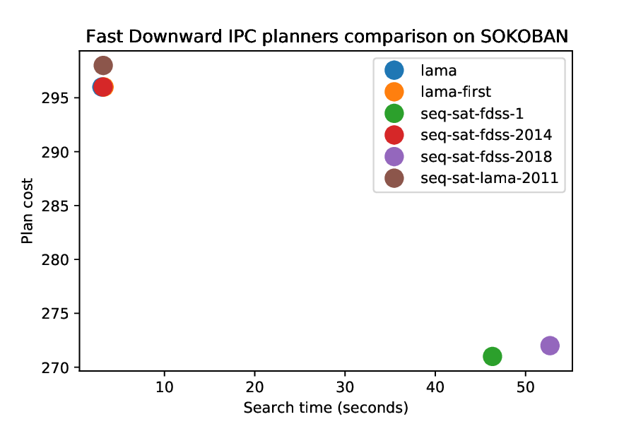
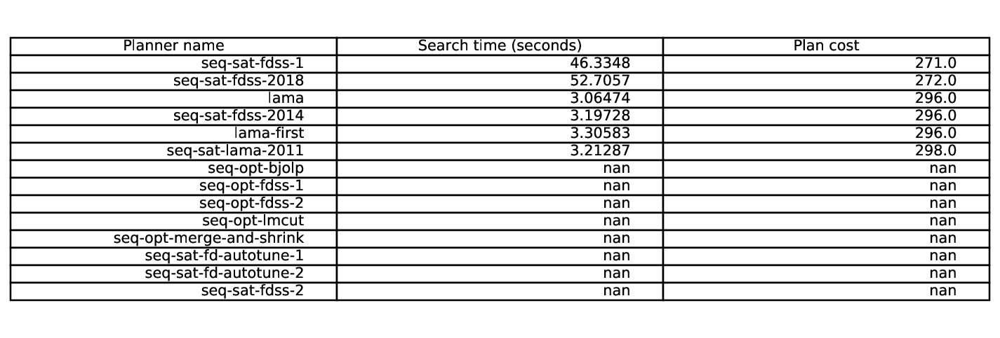
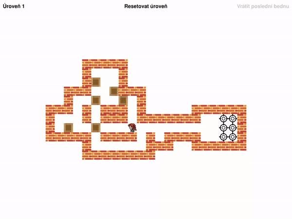

= Sokoban with automated planning

This is the solution to https://courses.fit.cvut.cz/MI-UMI/files/MI-UMI_seminar-04_planning.pdf[task 6B] from the third NI-UMI lecture at FIT CTU in 2020/21.

CTU username: `saframa6`

== Solution

First I have created https://github.com/TaIos/sokoban/blob/master/pddl/domain.pddl[domain] and https://github.com/TaIos/sokoban/blob/master/pddl/task.pddl[task].
Latter is automatically generated.
Then I used https://github.com/criticalhop/downward[Fast Downward] planning system.
Tested were all available solvers provided by Fast Downward.
At the time of testing there we https://github.com/TaIos/sokoban/blob/master/pddl/solvers_list.txt[14 solvers] available.
Each solver had https://github.com/TaIos/sokoban/blob/master/pddl/test.sh[30 minutes] limit to find and improve its solution on the given https://github.com/TaIos/sokoban/blob/master/assets/levels/level_1.txt[grid].
However, only 6 of them were able to find a solution.
Best solution was **271 steps** found by `seq-sat-fdss-1` in 46 seconds.

Second I have forked and modified the existing https://github.com/Gemkodor/sokoban[SOKOBAN game] and simulated the best path in it.

Lastly, from the https://github.com/TaIos/sokoban/tree/master/pddl/plans_10-11-2020_11-58-20[output] of solvers, I have created graphs describing solver performance.

== Performance

[#fig:001]

[caption="Figure 1: ",link=https://www.flickr.com/photos/javh/5448336655]

== Video of the best solution

- `seq-sat-fdss-1`, 271 steps, search time 46 seconds

