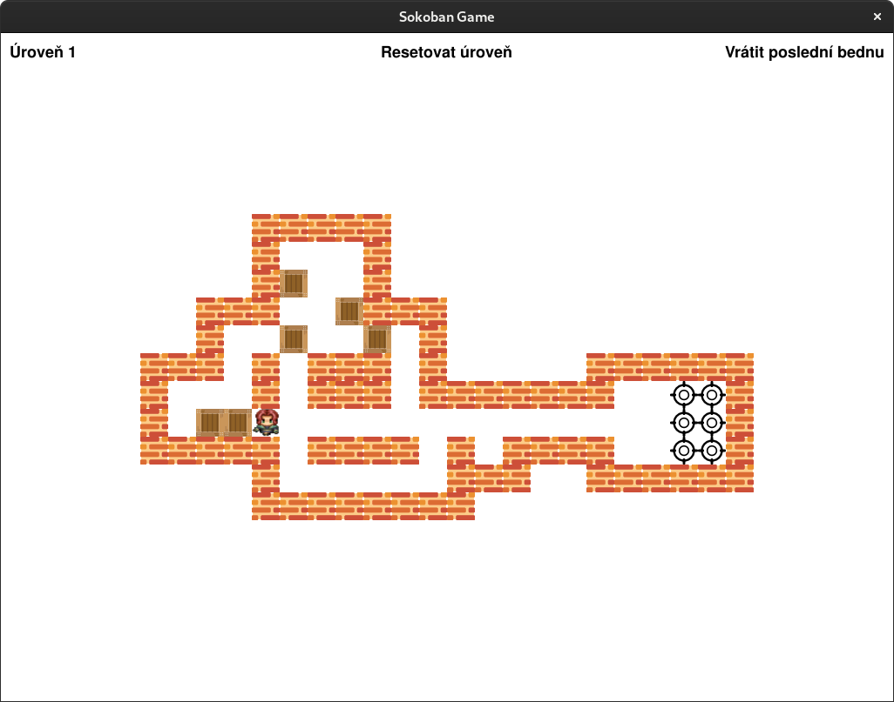

== Sokoban with automated planning

== Original game

- https://github.com/Gemkodor/sokoban

== Run & Install

- `python3.8.6`
- see `requirements.txt` file

- run with: `python Sokoban.py`

== Useful links

- https://github.com/criticalhop/downward[Fast Downward]
- http://www.fast-downward.org/IpcPlanners[Fast Downward Optimizers]
- https://pythonawesome.com/python-framework-for-ai-planning-and-automated-programming/[Poodle]

== Example image

